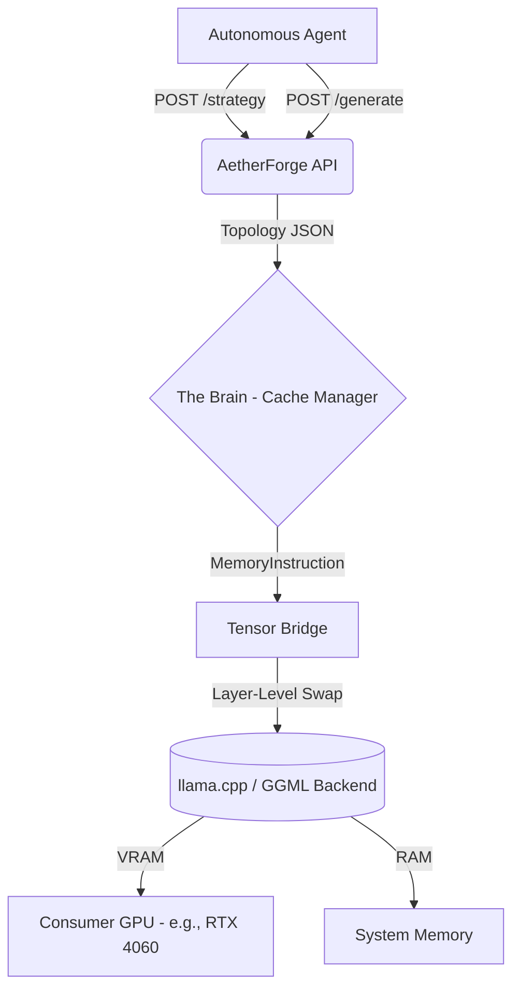

# ⚙️ AetherForge

[](https://www.python.org/downloads/)
[]()
[]()

**Agent-Aware Dynamic Memory Hypervisor for Local MoE Inference on Consumer Hardware**

AetherForge is an intelligent runtime layer that treats VRAM, System RAM, and secondary host storage as a single, unified memory hierarchy. By treating inference as an elastic, state-dependent task managed directly by autonomous agents rather than a static engine load, AetherForge allows massive Mixture-of-Experts (MoE) models to run comfortably on standard consumer hardware setups (e.g., 8GB VRAM GPUs paired with 32GB System RAM).

---

## 🚀 The Core Architecture: Phase-Based Orchestration

Instead of relying on rigid, permanent layer-pinning configurations that bottleneck long-running multi-task workflows, AetherForge introduces a dedicated control plane layer. It sits over local engines like `llama.cpp`, allowing software agents to dynamically declare operational intent (e.g., *"I am entering a high-fidelity coding phase"*). The hypervisor recalculates and reconstructs the tensor layout over hardware buses in real time to avoid Out-Of-Memory (OOM) faults while extracting optimal execution speeds.

### System Architecture



---

## ✨ Core Features

* **Dynamic Layer Orchestration:** Employs physical Fast-Swap mechanics to cycle between user configurations and runtime performance tiers in roughly ~5.8 seconds.
* **Economic Gatekeeper:** A deterministic cost/benefit validation system that automatically evaluates memory swap latency against active context scaling. If cache-destruction prefill penalties outpace generation dividends, the hypervisor intelligently blocks or adjusts the swap layout.
* **Predictive Cache Manager:** Maps deep MoE routing histories to optimize physical VRAM usage for the specific expert layers holding high activation thresholds.
* **Agent-First API:** Native FastAPI implementation complete with strict Pydantic schemas and schema exports ready for integration with tool-calling frameworks like LangChain, CrewAI, or n8n.

---

## 📊 Reference Performance Specification

*Profiled against an NVIDIA RTX 4060 (8GB VRAM) running DeepSeek-Coder-V2-Lite-Instruct.*

| Strategy Mode | Target Layers in VRAM | Generation Speed | Intended Workload Profile |
| --- | --- | --- | --- |
| **High Fidelity** | 15 | ~23.71 t/s | Multi-step reasoning, dense coding, complex pathfinding |
| **Balanced** | 10 | ~11.10 t/s | Routine agent coordination, dialog trees, text styling |
| **Aggressive Quant** | 2 | ~12.10 t/s | Fast sorting, intent classification, web scraping triage |

---

## ⚡ Getting Started

### Prerequisites

* Python 3.10+
* Local CUDA Toolkit compatible with your GPU architecture
* `llama-cpp-python` compiled with hardware-acceleration support

### Quick Start

1. **Initialize Environment:**
```bash
pip install -r requirements.txt

```


2. **Boot the Control Plane:**
```bash
uvicorn src.server:app --port 8000

```


3. **Incorporate Strategy Constraints (API Call):**
Command the hypervisor to optimize VRAM for high-depth engineering blocks:
```bash
curl -X POST [http://127.0.0.1:8000/system/strategy](http://127.0.0.1:8000/system/strategy) \
     -H "Content-Type: application/json" \
     -d '{"mode": "high_fidelity", "estimated_context_tokens": 500, "expected_output_tokens": 300}'

```


---

## 🗺️ Roadmap

* [x] **Phase 1:** Control Plane & Topology Analysis Foundations.
* [x] **Phase 2:** Dynamic Tensor Bridge Layouts & Fast-Swap Mechanics.
* [x] **Phase 3:** Deterministic Economic Gatekeeping Engine (Current).
* [ ] **Phase 4:** Asynchronous Tool Bindings for Agent Orchestrators (`AgentPlayground` / n8n / LangChain).
* [ ] **Phase 5:** Context Compression Utilities & Cross-Platform Silicon Portability.

---

## 🤝 Contributing

AetherForge is a standalone hypervisor platform built to maximize open consumer infrastructure. If you are developing dynamic optimization routines for local inference setups, please file an issue or submit a pull request.

```

```
