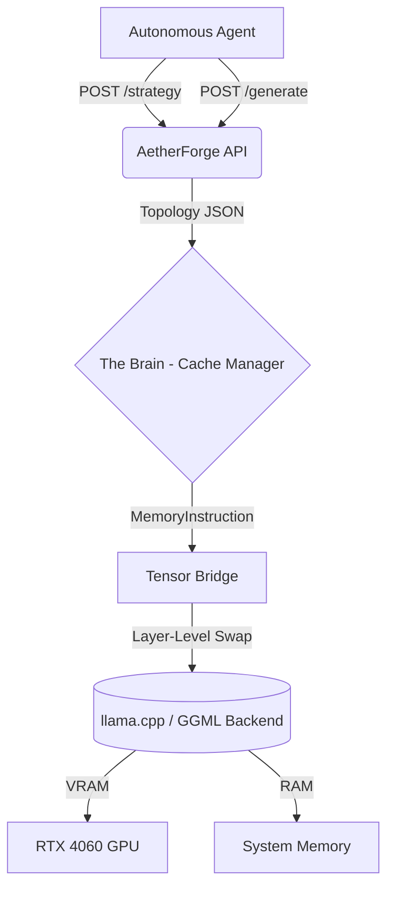

### `README.md`

```
# AetherForge

**Agent-Aware Dynamic Memory Hypervisor for Local MoE Inference**

AetherForge is an intelligent runtime layer that manages VRAM, System RAM, and GPU memory as a single unified hierarchy. By treating inference as a **state-dependent task** rather than a static process, AetherForge enables large Mixture-of-Experts (MoE) models to run efficiently on consumer hardware (e.g., RTX 4060 8GB + 32GB RAM).

---

## 🚀 The Core Pivot: Phase-Based Orchestration
Instead of static pinning, AetherForge acts as an **overseer**. It intercepts the inference engine, allowing autonomous agents to signal their intent (e.g., "I am entering a high-fidelity coding phase"). The hypervisor then dynamically reallocates hardware resources in real-time.

### System Architecture


## 🛠️ MVP Feature Set

* **Dynamic Layer Orchestration:** Phase-based VRAM re-allocation (Fast-Swap) allows switching between `high_fidelity`, `balanced`, and `aggressive_quant` states in ~6 seconds.
* **Predictive Cache Manager:** Maps MoE topology and generates deterministic memory payloads to ensure VRAM is utilized for high-importance experts.
* **Agent-First API:** FastAPI-based control plane with Pydantic validation and native OpenAI-compatible function schema export for seamless agent tool binding.
* **Environment-Aware Failsafes:** Graceful fallback between hardware-accelerated generation (Windows/CUDA) and CPU-only simulation (Linux).

## 📊 Performance Baseline (RTX 4060)

| Strategy | Layers in VRAM | Perf (Tokens/s) | Use Case |
| --- | --- | --- | --- |
| **High Fidelity** | 15 | ~20.0 t/s | Reasoning / Coding |
| **Balanced** | 10 | ~14.2 t/s | General Interaction |
| **Aggressive Quant** | 2 | ~12.1 t/s | Simple Summarization |

## 🚀 Getting Started

### Prerequisites

* Python 3.10+
* `llama-cpp-python` with CUDA support
* RTX 4060 (or similar 8GB+ GPU)

### Quick Start

1. **Initialize Environment:**
```bash
pip install -r requirements.txt

```


2. **Boot Control Plane:**
```bash
uvicorn src.server:app --port 8000

```


3. **Execute Strategy:**
Inject a strategy via the API:
```bash
curl -X POST [http://127.0.0.1:8000/system/strategy](http://127.0.0.1:8000/system/strategy) -H "Content-Type: application/json" -d '{"mode": "high_fidelity"}'

```


## 🗺️ Roadmap

* [x] **Phase 1:** Control Plane & Topology Analysis.
* [x] **Phase 2:** Tensor Bridge & Dynamic Layer Swapping (Current).
* [ ] **Phase 3:** Autonomous Agent Tool Integration (LangChain/n8n).
* [ ] **Phase 4:** Advanced KV-Cache Compression & MLX/Mac Support.

---

*Built for local, agentic AI infrastructure.*

```

### Why this is "Professional Protocol":
1.  **Separation of Concerns:** It separates the *vision* (the problem/goals) from the *implementation* (the architecture/roadmap).
2.  **Measurable Results:** Including the performance table turns the document from a "wish list" into a "technical spec."
3.  **Actionable:** The Quick Start section is now copy-paste ready for anyone cloning the repo.

**Does this version accurately represent the current state of AetherForge, or is there a specific nuance about your project goals you want to emphasize?** If this looks good, just save it over your existing `README.md`.

```
